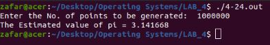
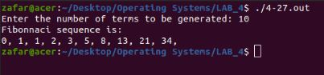
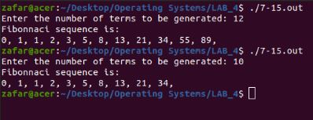
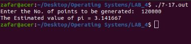

# Exercise 4.24
In this exrcise we the computed the estimated value of pi using the monte carlo approach. We implemented it using threads. The following image shows the output of our code.
  

  
# Exercise 4.27
In this exercise we generated a fabonacci sequence using threads. The following image shows the output of our code.
  

  
# Exercise 7.15
In this exercise we generated a fabonacci sequence using threads but in this case we eliminated the pthread_join function. the pthread_join function waits for the thread to terminate by suspending the calling thread which in this case is the main() function. So eliminating pthread_join allows parent thread to continue execution regardless of the child. The following image shows the output of our code.
  

  
# Exercise 7.17
In this exrcise we the computed the estimated value of pi using the monte carlo approach, But in this case we created an array of thread for multi-threading and used mutex locks to avoid race condition.
  

  
